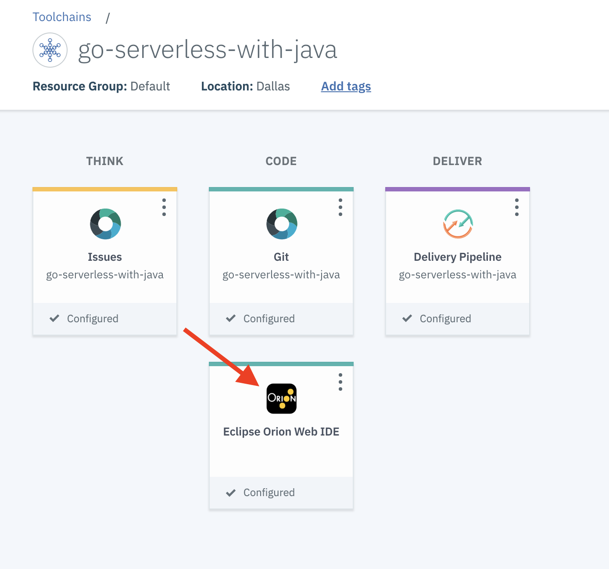
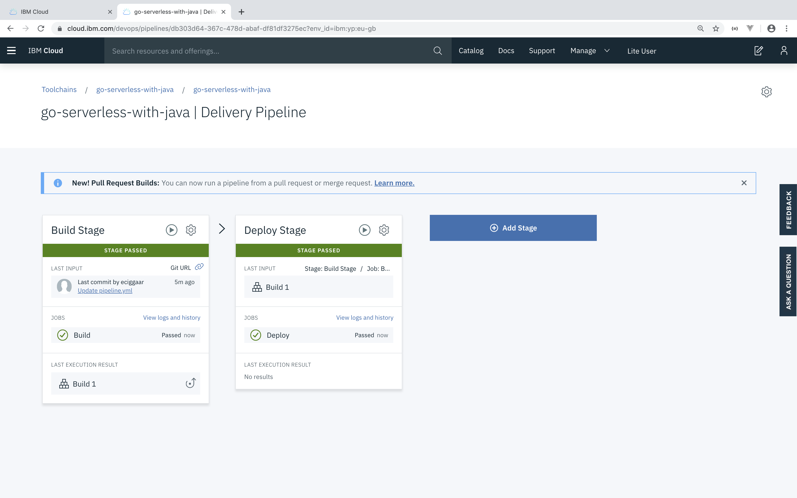
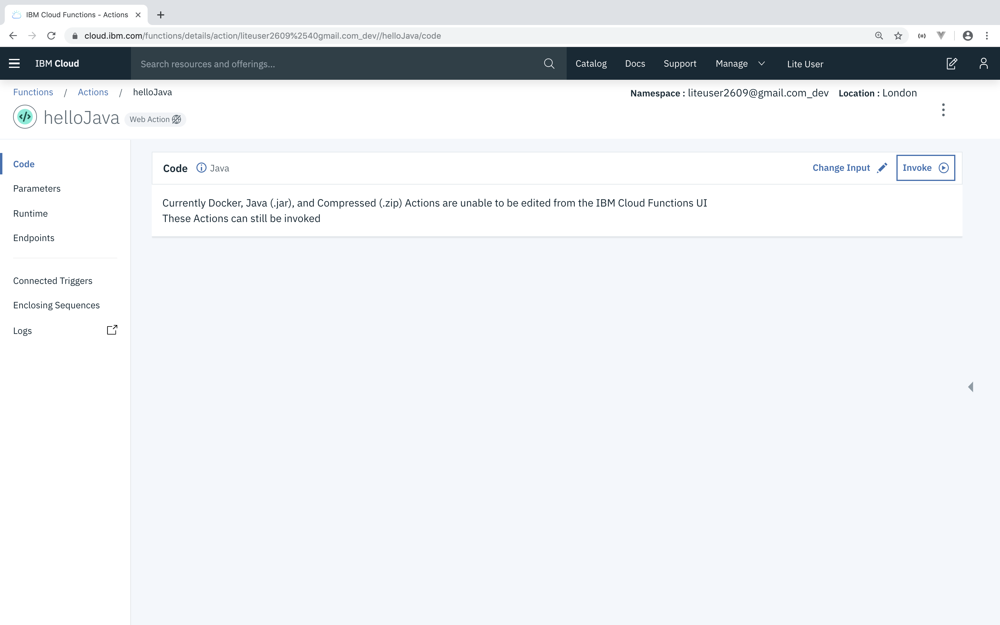
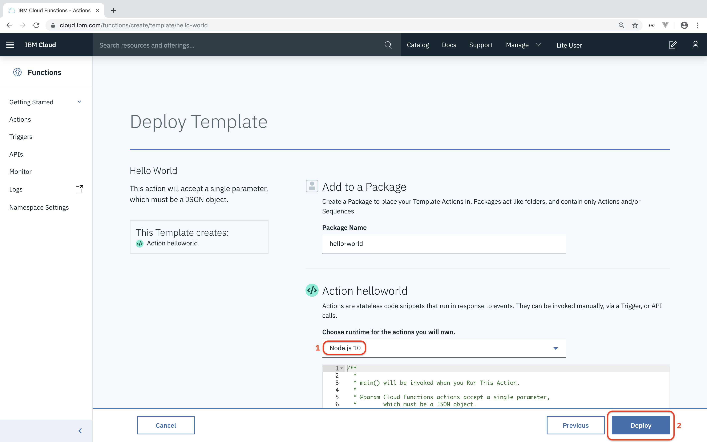
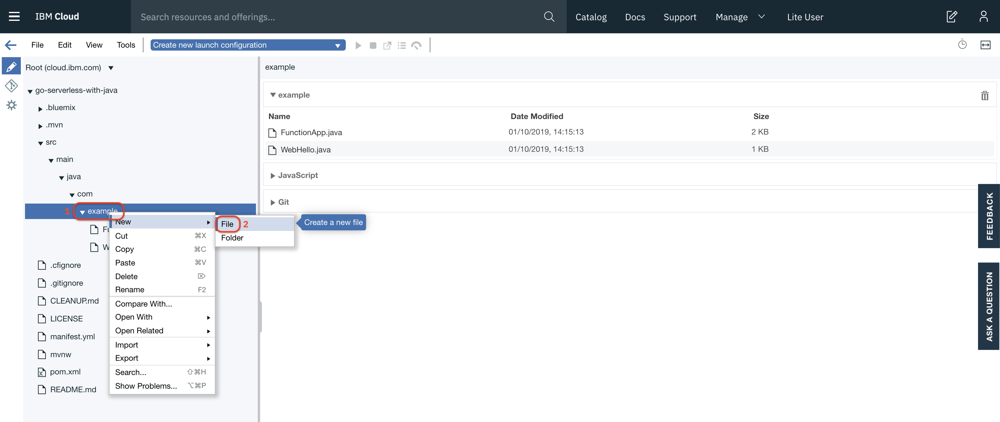
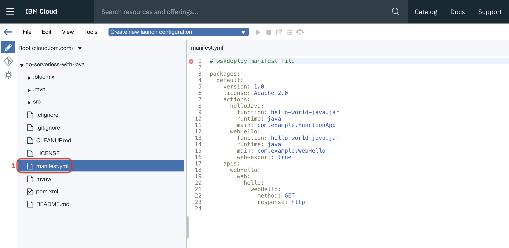

# Go Serverless with Java

Serverless functions are an emerging technology for decomposing business operations into very fine grain chunks of code. Functions provide advantages to organization by increasing agility and cost savings by allowing "scale to zero" when a function is no longer being actively used.

In this workshop we will look at how to write Serverless Functions in Java and run them on [Apache Openwhisk](https://openwhisk.apache.org/) hosted on IBM Cloud.

## Prerequisites:
<details>
  <summary>Click to expand</summary>
Here are the steps for configuring a Mac machine for this quicklab

1. Install Java 8+

	```
	brew cask install java
	```
2. [Install IBM Cloud CLI](https://github.com/IBM-Cloud/ibm-cloud-cli-release/releases/)
3. Install IBM Cloud Functions Plugin

	```
	ibmcloud plugin install cloud-functions
	```
4. Install git
	```
	brew install git
	```

</details>


## 0. Setup

1. <a href="https://ibm.biz/BdzhjJ"  target="_blank">Create an IBM Cloud Account</a>
2. Open terminal
3. Login into IBM Cloud CLI:

	```
	ibmcloud login
	```
4. Configure the CLI:

	```
	ibmcloud target --cf
	```
4. Clone repo:

	```
	git clone https://github.com/wkorando/java-serverless-quicklab.git
	```
5. Change directory to cloned repo:

	```
	cd serverless-java-quicklab
	``` 	

## 1. Execute a Serverless Function with the IBM Cloud CLI

1. Run the following command to invoke a test function from the command-line:

   ```
   ibmcloud wsk action invoke whisk.system/utils/echo -p message hello --result
   ```

   You should get back a result that looks like this:

   ```
   {
       "message": "hello"
   }
   ```

	This command verifies that IBM Cloud CLI is configured correctly . If this does not work, please contact the workshop organiser to provide assistance!

## 2. Build and Deploy your First Serverless Java Function

Let's build and deploy our own Java serverless function.

1. Build and jar the Java application:

	```
	./mvnw package
	```
2. Deploy the function to IBM Cloud:

	```
	ibmcloud wsk action create helloJava target/hello-world-java.jar --main com.example.FunctionApp
	```
3. Execute the function:

	```
	ibmcloud wsk action invoke --result helloJava --param name World
	```

	You should see:

	```
	{
	    "greetings": "Hello World"
	}
	```

`--result` means just show the results. Omit that, and see what you get back :)
This also adds the `--blocking` flag, discussed below.

## 3. Getting Familiar with OpenWhisk Commands

Let's take a deeper look at some of the common commands you will be using when running functions on OpenWhisk.

### Executing Functions Asynchronously

So far we have been executing functions synchronously with the `--result` tag. Let's take a look at executing functions asynchronously.

1. To execute a function in asynchronous mode simply omit `--result` when invoking the function:  

	```
	ibmcloud wsk action invoke helloJava --param name World
	```

   You should get a response that includes an id you can use to look up the result of the function later:

    ```
    ok: invoked /_/helloJava with id c51e11cf3bad42a39e11cf3badb2a3a3
    ```

2. Use the below command to retrieve the result of the function invocation:

    ```
    ibmcloud wsk activation result [id]
    ```
    You should get a response that looks something like this:

    ```
	{
	    "greetings": "Hello World"
	}
	```

	**Note:** Functions execute in asynchronous mode by default, you can also use the tag `--blocking` explicitly invoke a function in asynchronous mode.

### Viewing Function Invocation Information

When invoking a function OpenWhisk is generating diagnostic information that can be used for tracking system usage, debugging, and other purposes.

1. You can view the invocation information of the function we executed earlier with this command:

	```
	ibmcloud wsk activation get [id]
	```

	You should get a response back that looks something like this:

	```
	{
	    "namespace": "[youremail]@mail.com_dev",
	    "name": "helloJava",
	    "version": "0.0.1",
	    "subject": "[youremail]@mail.com",
	    "activationId": "c51e11cf3bad42a39e11cf3badb2a3a3",
	    "start": 1568061913141,
	    "end": 1568061913482,
	    "duration": 341,
	    "response": {
	        "status": "success",
	        "statusCode": 0,
	        "success": true,
	        "result": {
	            "greetings": "Hello! Welcome to OpenWhisk"
	        }
	    },
	    "logs": [
	        "2019-09-09T20:45:13.478869Z    stderr: Sep 09, 2019 8:45:13 PM com.example.FunctionApp main",
	        "2019-09-09T20:45:13.478917Z    stderr: INFO: invoked with params:"
	    ],
	    "annotations": [
	        {
	            "key": "path",
	            "value": "[youremail]@mail.com_dev/helloJava"
	        },
	        {
	            "key": "waitTime",
	            "value": 514
	        },
	        {
	            "key": "kind",
	            "value": "java:8"
	        },
	        {
	            "key": "timeout",
	            "value": false
	        },
	        {
	            "key": "limits",
	            "value": {
	                "concurrency": 1,
	                "logs": 10,
	                "memory": 256,
	                "timeout": 60000
	            }
	        },
	        {
	            "key": "initTime",
	            "value": 308
	        }
	    ],
	    "publish": false
	}
	```


### Viewing Function Invocation Logs

`ibmcloud wsk activation get` returns the logs from an invocation, but you can also just view the logs from innvocation to make debugging a bit easier.

1. To view the logs from an invocation run the following:

	```
	ibmcloud wsk activation logs [id]
	```
	You should get a return thaty looks like this:

	```
	2019-09-09T21:16:27.917303Z    stderr: Sep 09, 2019 9:16:27 PM com.example.FunctionApp main
	2019-09-09T21:16:27.917347Z    stderr: INFO: invoked with params:
	```
2. For longer running functions, you can tail the logs a function is producing with the following command:

	```
	ibmcloud wsk activation poll [id]
	```

### Retrieve Most Recent Function Execution

For shorthand purposes you can use the tag `--last` in-lieu of an id to retrieve information about an activation.

```
ibmcloud wsk activation [get|result|logs] --last
```

### Show Recent Function Invocations

You can view recent function invocations; id, function executed with the following:

```
ibmcloud wsk activation list
```

### Show Available Functions

You can view a list of all functions available in the current namespace with the following:

```
ibmcloud wsk list
```

## 4. Creating Web Actions

Functions can be setup so they can be called directly over http as well. Let's take a look at how to do this.

1. To allow a function to be executed over http run the following command:

	```
	ibmcloud fn action update helloJava --web true
	```

2. To find the url to execute the function run the following:

	```
	ibmcloud wsk action get helloJava --url
	```

	This command will return with the url to call you function:

	```
	https://[region].functions.cloud.ibm.com/api/v1/web/SAMPLE_URL/default/helloJava
	```

3.	Because this command is return JSON, we will need to append the end of the url with `.json` when calling it:

	```
	curl -i https://[region].functions.cloud.ibm.com/api/v1/web/SAMPLE_URL/default/helloJava.json
	```

4. 	You might have noticed the result was different this time. Previous we have been passing the param name to the function when invoking it through the command line `--param name World`. We can accomplish this same behavior by passing a value as a query param (e.g. `?name=World`):

	```
	curl -i https://[region].functions.cloud.ibm.com/api/v1/web/SAMPLE_URL/default/helloJava.json?name=World
	```


## 5. Use Functions to Return HTML

So far we have been just return JSON from our function, but functions are more flexible than that! Let's setup a function to return HTML:

1. Change the current directory we are in to the root package of our Java app:

	```
	cd src/main/java/com/example
	```
2. Create and open a new Java file `WebHello.java` with this command:

	```
	vi WebHello.java
	```
3. Copy in the body of the Java file:

	```
	package com.example;

	import com.google.gson.JsonObject;
	import com.google.gson.JsonPrimitive;

	import java.util.logging.Logger;

	/**
	 * Hello FunctionApp
	 */
	public class WebHello {
	  protected static final Logger logger = Logger.getLogger("basic");

	  public static JsonObject main(JsonObject args) {

	    JsonObject response = new JsonObject();
	    JsonPrimitive nameArg = args.getAsJsonPrimitive("name");

	    String result;
	    if (nameArg == null) {
	      result = "Welcome to OpenWhisk";
	    } else {
	      result = "Hello " + nameArg.getAsString();
	    }
	    response.addProperty("body", "<html><body><h3>" + result + "</h3></body></html>");


	    logger.info("invoked with params:");
	    return response;
	  }
	}
	```
4. Save and exit from vi by typing `:wq`

5. 	Return to the root of the repo:

	```
	cd ../../../../..
	```
6. Rebuild the Java .jar

	```
	./mvnw package
	```

7. Functions can be updated if you want to change their behavior. To our existing fuinction run the following command:

	```
	ibmcloud wsk action create webHello target/hello-world-java.jar --main com.example.WebHello --web true
	```

4. Get the url for the function with the following command like earlier:

	```
	ibmcloud fn action get webHello --url
	```

5. Invoke the url directly from the your web browser

6. Like earlier, you can change the `name` query parameter to change the value being returned.

## 6. Deployment Pipeline
Currently we are deploying functions directly from our local computer. This process of building and deploying functions won't work within an organization. Let's set up a so-called toolchain pipeline that will clone this repo to a private gitlab repo and sets up a delivery pipeline with two stages. One that builds the java code and the second one that deploys the serverless functions to the cloud.

1. To create the toolchain, CTRL-click the following button:
	
	[](https://cloud.ibm.com/devops/setup/deploy?repository=https://github.com/wkorando/go-serverless-with-java&branch=master&env_id=ibm:yp:us-south)

2. For the Lite account users, make sure the region (1) is set to your default region. For Europe based users this most likely will be London. Dallas will be the default region when your closer to the US. Check with your workshop hosts if you're not sure. Next, click (2) to configure the Delivery Pipeline.

	

3. Next create an API Key for this repo by clicking **Delivery Pipeline** and then the **Create** button. The default values that are generated should be fine.

	

4. Cick the **Create** button in the top right corner of the page.

5. After a few moments, CTRL-click the **Eclipse Orion Web IDE** card in the middle of the page. When making code changes, we will use this web based IDE as it has been pre-configured to communicate with the newly created GitLab repo.

	

6. Next, return to your toolchain by clicking: [https://cloud.ibm.com/devops/toolchains](https://cloud.ibm.com/devops/toolchains). This should list the 'go-serverless-with-java' toolchain. If you don't see a toolchain make sure that the selected region matches the one that was selected when creating the toolchain. Again, most likely this is London for Europe based users and Dallas for those closer to the US. In the toolchain, CTRL-click the Delivery Pipeline tile to check out the details. You should see a screen similar to:



If you want, you can click the build or deploy stage to further look into the details (build logs, deployment logs, etc.). When all stages are finished -- as depicted above -- you're ready to check out the serverless actions in the Cloud Functions dashboard. Whenever we push changes to our newly created GitLab repo, this will kick off the deployment pipeline to update the serverless actions.

### manifest.yml

So far we have been defining the behavior of the functions we have been deploying through the IBM Cloud CLI. This isn't ideal as changes could be forgotten or lost. Instead of using the CLI to define this behavior, we will using the [manifest.yml](mainfest.yml). This will allow us to keep the configuration of our functions in the same location as the code. This is a concept called [configuration-as-code](https://rollout.io/blog/configuration-as-code-everything-need-know/).

Currently the manifest.yml looks like this: 

```
packages:
  default:
    version: 1.0
    license: Apache-2.0
    actions:
      helloJava:
        function: hello-world-java.jar
        runtime: java
        main: com.example.FunctionApp
      webHello:
        function: hello-world-java.jar
        runtime: java
        main: com.example.WebHello      
        web-export: true
``` 

In the above yaml `helloJava` & `webHello` are defining the names of our functions, the fields under them are defining the type of function, where the function is located, the main class, and if should be web enabled (default is false). We will continue to work with the manifest.yml going forward int the workshop, but you can read more about it [here](https://cloud.ibm.com/docs/openwhisk?topic=cloud-functions-deploy).

### Running Locally

For time and convenience we will be using the web based IDE, but if you prefer completing the following steps on your local machince eapnd the section below. 

<details>
  <summary>Click to expand</summary>
  https://[region].git.cloud.ibm.com/profile/personal_access_tokens
</details> 

## 7. Viewing the Functions Dashboard

IBM Cloud provides a convenient dashboard for viewing your functions. You can access this dashboard here: [https://cloud.ibm.com/functions/actions](https://cloud.ibm.com/functions/actions). It should list the following actions:


These actions have been created via the CLI at the start of this lab. They have in the previous section been updated via the delivery pipline. The latter also defined an API that can be further explored in the API section of the dashboard. We'll dive further into that topic in the API Gateway section of this lab. 

1. The serverless functions functions `helloJava` and `webHello` are both written in Java. Hence, the code cannot be viewed and changed via the dashboard. They can be invoked though. 

	Invoke the function `helloJava` by clicking the action and then click Invoke.

	

	As you can see the result is similar to when the function is invoked via the command line. 

2. Next, change the Input by clicking 'Change input' and the input to
	
	```json
	{
		"name": "your name here.."
	}
	```
	Change the value of 'name' to your own name, or something you like and click Apply. Click Invoke to invoke this function with the changed input. The result should be 
	```json
	{
	"greetings": "Hello your name here..."
	}
	```
	Finally, return to the actions dashboard. 

### Create a new action via the Cloud Functions dashboard (OPTIONAL)

If you want to explore what the possibilities are when creating cloud functions via the UI, click the 'Create' button. In the next page, you can either create new triggers and/or sequences but also new actions via a quick template or from scratch. Select the Quickstart templates to continue and choose Hello World. You should see a screen similar to 



Now select a favourite language using the dropdown (1). We've chosen for NodeJS 10 in the screenshot above. Click Deploy (2) to create the new action written in NodeJS. It outputs practically the same as our `helloJava` function. When no input is given, the function returns 
```json
"greeting": "Hello stranger!"
```
When there is input, the result is the same as for the `helloJava`. Please see for yourself by invoking the `hello-world` action with some input as well. Next, let's add more value to our serverless functions by defining sequences.

## 8. Sequences (work in progess)

Serverless functions should, by design, be small nearly atomic actions. This means that a single serverless function often provides limited value. Adding them to a sequence enables you to leverage the combined value of the individual functions. In this section we will set up such a sequence. A sequence allows us to pass the returned value from one function to another. The sequence that we will be creating, will consist of two functions. One that returns the _n_<sup>th</sup> Fibonnaci number and its immediate predecessor (where _n_ is the input value). The second one takes these two Fibonacci numbers as input and returns the calculated ratio of these numbers.

### The actions for the sequence

So, what are those Fibonacci numbers again??

>In mathematics, the Fibonacci numbers, commonly denoted _F_<sub>n</sub> form a sequence, called the Fibonacci sequence, such that each number is the sum of the two preceding ones, starting from 0 and 1. 
>  
>That is, F<sub>0</sub> = 0, _F_<sub>1</sub> = 1 and _F_<sub>n</sub> = _F_<sub>n-1</sub> + _F_<sub>n-2</sub> for _n_ > 2. The beginning of the sequence is thus: 0, 1, 1, 2, 3, 5, 8, 13, 21, 34, 55, 89, 144,...
>  
>Fibonacci numbers are strongly related to the golden ratio: Binet's formula expresses the _n_<sup>th</sup> Fibonacci number in terms of _n_ and the golden ratio, and implies that the ratio of two consecutive Fibonacci numbers tends to the golden ratio as n increases. If you want to read more on this topic, please visit the source of this quote: https://en.wikipedia.org/wiki/Fibonacci_number

1. Our first action returns for a given number _n_, the _n_<sup>th</sup> Fibonacci number and its immediate predecessor. For this, go to your [toolchain](https://cloud.ibm.com/devops/toolchains) in IBM Cloud and open the Orion Web IDE. Then browse in the 'go-serverless-with-java' repo to the Java source code location (1) and right-click to create a new file (2). Name this file `FibonacciNumber.java`.

	

2. Next, copy the code below at paste it to line 1 of the file `FibonacciNumber.java` in the Web IDE.

	```java
	package com.example;

	import java.math.BigInteger;
	import java.util.logging.Logger;
	import com.google.gson.JsonObject;
	import com.google.gson.JsonPrimitive;

	public class FibonacciNumber {
		protected static final Logger logger = Logger.getLogger("basic");

		public static JsonObject main (JsonObject args) {
			JsonObject response = new JsonObject();
			JsonPrimitive numberArg = args.getAsJsonPrimitive("number");
			
			try {
				int n = numberArg.getAsInt();

				// Special case: F(0) = 0 by definition
				if (n == 0) {
					response.addProperty("input", n);
					response.addProperty("output", 0);

					return response;
				}

				// Initialize counters to calculate n-th Fibonacci number
				BigInteger a = BigInteger.ZERO;
				BigInteger b = BigInteger.ONE;
				BigInteger c;
				
				// Start iterating & calculate the sum of the two previous numbers
				for (int i = 2; i <= n; i++) {
					c = a.add(b);
					a = b;
					b = c;
				}

				// Construct response JSON. The response contains the input parameter, as well as the n-th and (n-1)-th Fibonacci number
				response.addProperty("input", n);
				response.addProperty("output1", a);
				response.addProperty("output2", b);
			} catch (Exception e) {
				throw new Error(e.getMessage());
			}

			return response;
		}  
	}
	```

2. The second function should calculate the ratio of two given numbers. For this, create a new Java file `CalculateRatio.java` in same location as where you created the file `FibonacciNumber.java`.

3. Next, copy the code below and paste it on line 1 of the file `CalculateRatio.java` in the Web IDE.

	```java
	package com.example;

	import java.math.BigDecimal;
	import java.util.logging.Logger;
	import com.google.gson.JsonObject;

	public class CalculateRatio {
		protected static final Logger logger = Logger.getLogger("basic");

		public static JsonObject main (JsonObject args) {
			JsonObject response = new JsonObject();      
			int n = args.getAsJsonPrimitive("input").getAsInt();     
			BigDecimal arg1 = new BigDecimal(1);
			BigDecimal arg2 = new BigDecimal(1);
			BigDecimal ratio = new BigDecimal(1);

			try {
				// Obtain the two numbers from the input
				if (n == 0) {
					throw new ArithmeticException("Cannot calculate the golden ratio of just one Fibonnaci number. Need at least two!!");
				} else {
					arg1 = args.getAsJsonPrimitive("output1").getAsBigDecimal();
					arg2 = args.getAsJsonPrimitive("output2").getAsBigDecimal();            
		
					ratio = arg2.divide(arg1);    
				}
			} catch (ArithmeticException e) {
				if (n >= 2) {
					ratio = arg2.divide(arg1, 15, BigDecimal.ROUND_CEILING);
				} else { 
					// For n = 1, the ratio cannot be calculated. Cannot divide by zero...
					logger.warning(e.getMessage());
					response.addProperty("message", "Cannot divide by zero. Provide a number greater than 1.");                
				}
			}
			
			// No error thrown and reponse does not have a message property, so calculated ratio can be added
			if (!response.has("message")) {
				response.addProperty("ratio", ratio);
			}

			return response;
		}  
	} 
	```

4. Now the two new functions have been defined, it is time to update the OpenWhisk manifest YAML. In this config file we need to define the two new actions, as well as the sequence. For this, in the Web IDE open the `manifest.yml` file (1).



5. Next, add the following definitions to manifest YAML. Note that all these definitions are added in a seperate package 'golden-ratio' and that we also added an action that also calculates the ratio, but returns HTML instead of JSON.
	```yaml
	golden-ratio:
	   actions:
	      fibonacciNumber:
	         function: hello-world-java.jar
	         runtime: java
	         main: com.example.FibonacciNumber
	      calculateRatio:
	         function: hello-world-java.jar
	         runtime: java
	         main: com.example.CalculateRatio
	      calculateRatioWeb:
	         function: hello-world-java.jar
	         runtime: java
	         main: com.example.CalculateRatioWeb        
	```

6. The new serverless functions have been added to the manifest YAML. The sequence is added in a similar way. Look at the following piece of config:
	```yaml
	sequences:
	   ratio:
	      actions: fibonacciNumber, calculateRatio
	   ratioWeb:
	      actions: fibonacciNumber, calculateRatioWeb
	      web: true
	```
	Add this to the `manifest.yml` file in the Web IDE. The 'sequences' entry should be on the same level as the 'actions' under the 'golden-ratio' package. This piece of config defines two sequences, `ratio` and `ratioWeb`. They both first invoke the `fibonacciNumber` action. Then, the output of this action is used to invoke the `calculateRatio` or the `calculateRatioWeb` action -- depending on which sequence you're looking into.

7. It's time to commit our changes to the GitLab repo and push them the master branch.

## 9. API Gateway

An API Gateway can be a great way to make your functions more accessible and to monitor their usage. Let's update our function to make it accessible through the API Gateway IBM Cloud provides. 

Let's update the `webHello` function we created earlier to be accessible through API Gateway. 

**Note:** For a function to be accessible through the API it must also be enabled as a web action.

1. We will need to append to the end of **manifest.yml** the following:

	```yaml
	apis:
	  webHello: #Endpoint ID
	    web: #API Basepath
	      hello: #Endpoint Path
	        webHello: #Function Reference
	          method: GET
	          response: http
	```
2. Commit and push these changes to start the deployment pipeline
3. Once the build has completed open the [Functions API Management](https://cloud.ibm.com/functions/apimanagement) page and click the **webHello** row. It should look something like this:
	
4. This opens the management page for the API endpoint. Under route is the route to the endpoint, copy that value and append the endpoint path to it `/hello` and that will call execute the `webHello` function. Like earlier you can add a query param `?name=JFall` to it as well. 

### Rate Limiting 

There are a number of ways you can configure your API. A common one would be rate limiting. Because with functions you are paying for every CPU cycle, limiting the number of times a function can be executed can be a great way of making sure you don't get stuck with a huge bill at the end of the month because a script or application got stuck in an endless loop. 


## 10. Triggers 

Triggers can be used to define conditions for the execution of a function. This can be useful for scheduling a function to execute on a certain schedule or when a certain defined limit has been reached.


## 11. Connecting to Services

IBM Cloud has a catalog of services available to handle the needs of the enterprise. In this step we will connect our function to the Watson service to help calculate a value.

**Collaborator:** Pratik Patel [Github](https://github.com/prpatel) [Twitter](https://twitter.com/prpatel)

