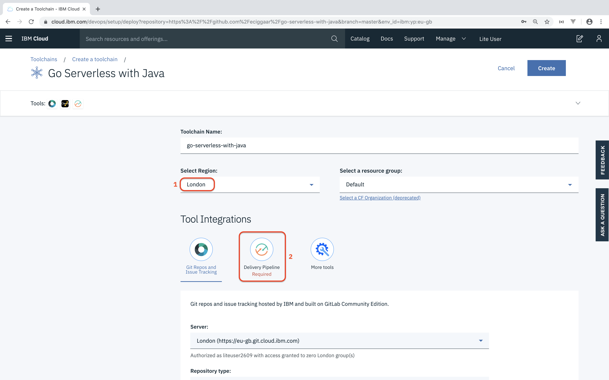

## 6. Building a Deployment Pipeline

So far we are deploying functions directly from our local computer. This process of building and deploying functions won't work within an organization. Let's set up a so-called toolchain, that will clone this repo to a private GitLab repo and sets up a delivery pipeline with two stages. One that builds the java code and the second one that deploys the serverless functions to the cloud.

1. To create the toolchain, CTRL-click the following button:
	
    [](https://cloud.ibm.com/devops/setup/deploy?repository=https://github.com/eciggaar/go-serverless-with-java&branch=master&env_id=ibm:yp:us-south)

2. For the Lite account users, make sure the region (1) is set to your default region. For Europe based users this most likely will be London. Dallas will be the default region when your closer to the US. Check with your workshop hosts if you're not sure. Next, click (2) to configure the Delivery Pipeline.

	

3. Next create an API Key for this repo by clicking **Delivery Pipeline** and then the **Create** button. The default values that are generated should be fine.

	

4. Cick the **Create** button in the top right corner of the page.

5. After a few moments, CTRL-click the **Eclipse Orion Web IDE** tile in the middle of the page. When making code changes, we will use this web based IDE as it has been pre-configured to communicate with the newly created GitLab repo.

	

6. Next, return to your toolchain by clicking [https://cloud.ibm.com/devops/toolchains](https://cloud.ibm.com/devops/toolchains). This should list the 'go-serverless-with-java' toolchain. If you don't see a toolchain make sure that the selected region matches the one that was selected when creating the toolchain. Again, most likely this is London for Europe based users and Dallas for those closer to the US. In the toolchain, CTRL-click the **Delivery Pipeline** tile to check out the details. You should see a screen similar to:


If you want, you can click the build or deploy stage to further look into the details (build logs, deployment logs, etc.). When all stages are finished -- as depicted above -- you're ready to check out the serverless functions in the Cloud Functions dashboard. Whenever we push changes to our new private GitLab repo, this will kick off the deployment pipeline to update the serverless functions.

### manifest.yml

So far we have been defining the behavior of the functions we have been deploying through the IBM Cloud CLI. This isn't ideal as changes could be forgotten or lost. Instead of using the CLI to define this behavior, we will using the [manifest.yml](mainfest.yml). This allows us to keep the configuration of our functions in the same location as the code. This is a concept called [configuration-as-code](https://rollout.io/blog/configuration-as-code-everything-need-know/).

Currently the manifest.yml looks like this: 

```yaml
packages:
  default:
    version: 1.0
    license: Apache-2.0
    actions:
      helloJava:
        function: hello-world-java.jar
        runtime: java
        main: com.example.FunctionApp
      webHello:
        function: hello-world-java.jar
        runtime: java
        main: com.example.WebHello      
        web-export: true
``` 

In the above yaml `helloJava` & `webHello` are defining the names of our functions, the fields under them are defining the type of function, where the function is located, the main class, and if the function should be web enabled (default is false). We will continue to work with the manifest.yml going forward in the workshop, but you can read more about it [here](https://cloud.ibm.com/docs/openwhisk?topic=cloud-functions-deploy).

<p  align="center">
	<font size="4">
 		<a href="STEP5.md"><< Back</a>&nbsp;&nbsp;&nbsp;&nbsp;<a href="README.md">Index</a>&nbsp;&nbsp;&nbsp;&nbsp;<a href="STEP7.md">Next >></a></td>
 </font>
</p>
