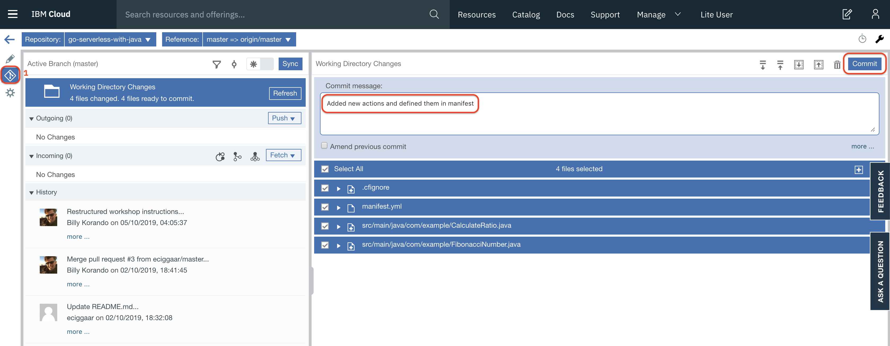
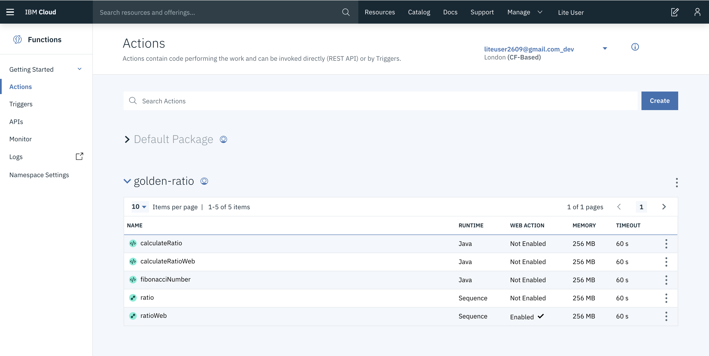

## 8. Creating a Sequence

Serverless functions should, by design, be small nearly atomic actions. This means that a single serverless function often provides limited value. Adding them to a sequence enables you to leverage the combined value of the individual functions. 

In this section we will set up such a sequence. A sequence allows us to pass the returned value from one function to another. The sequence that we will be creating, will consist of two functions. One that returns the _n_<sup>th</sup> Fibonnaci number and its immediate predecessor (where _n_ is the input value). The second one takes these two Fibonacci numbers as input and returns the calculated ratio of these numbers.

### The Good Old Fibonacci Numbers and its Sequence

So, what are those Fibonacci numbers again??

>In mathematics, the Fibonacci numbers, commonly denoted _F_<sub>n</sub> form a sequence, called the Fibonacci sequence, such that each number is the sum of the two preceding ones, starting from 0 and 1. That is,
>  
>F<sub>0</sub> = 0,&nbsp;&nbsp;_F_<sub>1</sub> = 1 
>  
>and 
>  
>_F_<sub>n</sub> = _F_<sub>n-1</sub> + _F_<sub>n-2</sub>&nbsp;&nbsp;for&nbsp;&nbsp;_n_ > 2
>  
>Fibonacci numbers are strongly related to the golden ratio: Binet's formula expresses the _n_<sup>th</sup> Fibonacci number in terms of _n_ and the golden ratio, and implies that the ratio of two consecutive Fibonacci numbers tends to the golden ratio as n increases. 

For more information, please visit the [wiki](https://en.wikipedia.org/wiki/Fibonacci_number) page on this topic. 

Now let's build a serverless action and a sequence to determine the _n_<sup>th</sup> Fibonacci number and to calculate the ratio of this number and its immediate predecessor in the Fibonacci sequence.

### Creating actions and sequences

1. Our first action returns for a given number _n_, the _n_<sup>th</sup> Fibonacci number and its immediate predecessor. For this, go to your [toolchain](https://cloud.ibm.com/devops/toolchains) in IBM Cloud and open the Orion Web IDE. Then browse in the 'go-serverless-with-java' repo to the Java source code location (1) and right-click to create a new file (2). Name this file `FibonacciNumber.java`.

	

2. Next, copy the code below at paste it to line 1 of the file `FibonacciNumber.java` in the Web IDE.

	```java
	package com.example;

	import java.math.BigInteger;
	import java.util.logging.Logger;
	import com.google.gson.JsonObject;
	import com.google.gson.JsonPrimitive;

	public class FibonacciNumber {
	   protected static final Logger logger = Logger.getLogger("basic");

	   public static JsonObject main (JsonObject args) {
	      JsonObject response = new JsonObject();
	      JsonPrimitive numberArg = args.getAsJsonPrimitive("number");
			
	      try {
	         int n = numberArg.getAsInt();

	         // Special case: F(0) = 0 by definition
	         if (n == 0) {
	            response.addProperty("input", n);
	            response.addProperty("output", 0);

	            return response;
	        }

	        // Initialize counters to calculate n-th Fibonacci number
	        BigInteger a = BigInteger.ZERO;
	        BigInteger b = BigInteger.ONE;
	        BigInteger c;
				
	        // Start iterating & calculate the sum of the two previous numbers
	        for (int i = 2; i <= n; i++) {
	           c = a.add(b);
	           a = b;
	           b = c;
	        }

	        // Construct response JSON. The response contains the input parameter, as well as the n-th and (n-1)-th Fibonacci number
	        response.addProperty("input", n);
	        response.addProperty("output1", a);
	        response.addProperty("output2", b);
	      } catch (Exception e) {
             throw new Error(e.getMessage());
	      }

	      return response;
	   }  
	}
	```

2. The second function should calculate the ratio of two given numbers. For this, create a new Java file `CalculateRatio.java` in the same location as where you created the file `FibonacciNumber.java`.

3. Next, copy the code below and paste it on line 1 of the file `CalculateRatio.java` in the Web IDE.

	```java
	package com.example;

	import java.math.BigDecimal;
	import java.util.logging.Logger;
	import com.google.gson.JsonObject;

	public class CalculateRatio {
	   protected static final Logger logger = Logger.getLogger("basic");

	   public static JsonObject main (JsonObject args) {
	      JsonObject response = new JsonObject();      
	      int n = args.getAsJsonPrimitive("input").getAsInt();     
	      BigDecimal arg1 = new BigDecimal(1);
	      BigDecimal arg2 = new BigDecimal(1);
	      BigDecimal ratio = new BigDecimal(1);

	      try {
	         // Obtain the two numbers from the input
	         if (n == 0) {
	            throw new ArithmeticException("Cannot calculate the golden ratio of just one Fibonnaci number. Need at least two!!");
	         } else {
	            arg1 = args.getAsJsonPrimitive("output1").getAsBigDecimal();
	            arg2 = args.getAsJsonPrimitive("output2").getAsBigDecimal();            
		
	            ratio = arg2.divide(arg1);    
	         }
	      } catch (ArithmeticException e) {
	         if (n >= 2) {
	            ratio = arg2.divide(arg1, 15, BigDecimal.ROUND_CEILING);
	         } else { 
	            // For n = 1, the ratio cannot be calculated. Cannot divide by zero...
	            logger.warning(e.getMessage());
	            response.addProperty("message", "Cannot divide by zero. Provide a number greater than 1.");                
	         }
	      }
			
	      // No error thrown and reponse does not have a message property, so calculated ratio can be added
	      if (!response.has("message")) {
	         response.addProperty("ratio", ratio);
	      }

	      return response;
	   }  
	} 
	```

4. Now the two new functions have been defined, it is time to update the OpenWhisk manifest YAML. In this config file we need to define the two new actions, as well as the sequence. For this, in the Web IDE open the `manifest.yml` file (1).

	

5. Next, add the following definitions to manifest YAML. Note that all these definitions are added in a seperate package 'golden-ratio'. Make sure the 'golden-ratio' package has the same indentation as the 'default' package.
	```yaml
	golden-ratio:
      actions:
        fibonacciNumber:
          function: hello-world-java.jar
          runtime: java
          main: com.example.FibonacciNumber
        calculateRatio:
          function: hello-world-java.jar
          runtime: java
          main: com.example.CalculateRatio
        calculateRatioWeb:
          function: hello-world-java.jar
          runtime: java
          main: com.example.CalculateRatioWeb        
	```
	Note that we've also added the action `CalculateRatioWeb` that also calculates the ratio, but returns HTML instead of JSON.

6. The sequence is added in a similar way as the serverless that we added in the previous step. For this, look at the following piece of config:
	```yaml
	sequences:
      ratio:
        actions: fibonacciNumber, calculateRatio
      ratioWeb:
        actions: fibonacciNumber, calculateRatioWeb
        web: true
	```
	Add this to the `manifest.yml` file in the Web IDE. The 'sequences' entry should have the same indentation as the 'actions' in the 'golden-ratio' package.  This piece of config defines two sequences, `ratio` and `ratioWeb`. They both first invoke the `fibonacciNumber` action. The output of the `fibonacciNumber` action is used to invoke the `calculateRatio` or the `calculateRatioWeb` action -- depending on which sequence you're looking into.

7. We're ready to commit our changes to the GitLab repo and to push them to the master branch. For this, in your Web IDE, click the git icon (1) on the left hand side. This opens the GitLab repo with the three files that have either been added or changed. Enter a commit message in the designated text area and click 'Commit'.

	

8. Finally, click 'Sync' (1) to push the changes to the master branch. Next, click the 'Back to Toolchains' button (2) to return to the toolchain overview page. Select the 'Delivery Pipeline' tile to monitor the progress of your new build. The pipeline got triggered by the push of your changes to the master branch.

	

	Once the two stages in the pipeline successfully completed, go to the [Cloud Functions](https://cloud.ibm.com/functions/actions) section in IBM Cloud to see the result of the deployment. A new package 'golden-ratio' has been defined, showing 3 new actions and 2 new sequences. 

	

<p  align="center">
	<font size="4">
 		<a href="STEP7.md"><< Back</a>&nbsp;&nbsp;&nbsp;&nbsp;<a href="README.md">Index</a>&nbsp;&nbsp;&nbsp;&nbsp;<a href="STEP9.md">Next >></a></td>
 </font>
</p>